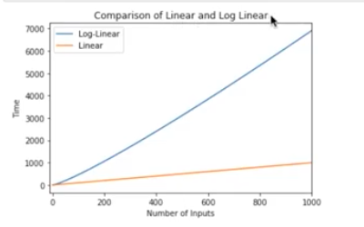
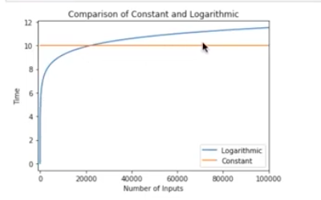
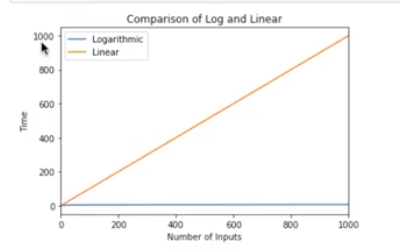
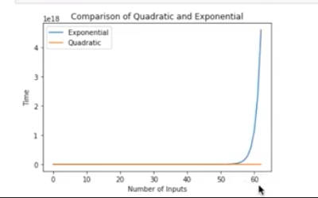
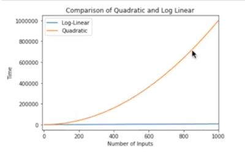

# Class 07: Game of Greed 2

## [Python Scope & the LEGB Rule: Resolving Names in Your Code](https://realpython.com/python-scope-legb-rule/)

## Understanding Scope

The **scope** of a name defines the area of a program in which you can unambiguously access that name, such as variables, functions, objects, and so on. A name will only be visible to and accessible by the code in its scope. Several programming languages take advantage of scope for avoiding name collisions and unpredictable behaviors. 

Most commonly, you’ll distinguish two general scopes:

- **Global scope**: The names that you define in this scope are available to all your code.

- **Local scope**: The names that you define in this scope are only available or visible to the code within the scope.

> Scope is important because in other languages, like BASIC, they only have global scope for the names of variables.

When you use a language that implements scope, there’s no way for you to access all the variables in a program at all locations in that program. In this case, your ability to access a given name will depend on where you’ve defined that name.

When you can access the value of a given name from someplace in your code, you’ll say that the name is **in scope**. If you can’t access the name, then you’ll say that the name is **out of scope**.

## Names and Scopes in Python

Since Python is a [dynamically-typed](https://wiki.python.org/moin/Why%20is%20Python%20a%20dynamic%20language%20and%20also%20a%20strongly%20typed%20language) language, variables in Python come into existence when you first assign them a value. On the other hand, functions and classes are available after you define them using [def](https://docs.python.org/3/reference/compound_stmts.html#def) or [class](https://docs.python.org/3/reference/compound_stmts.html#class-definitions), respectively. Finally, [modules](https://realpython.com/python-modules-packages/) exist after you import them. As a summary, you can create Python names through one of the following operations:

| Operation | Statement |
| --- | --- |
| [Assignments](https://docs.python.org/3/reference/simple_stmts.html#assignment-statements) | x = value |
| [Import operations](https://realpython.com/courses/python-imports-101/) | import module or from  |module import name |
| Function definitions | def my_func(): ... |
|Argument definitions in the context of functions | def my_func(arg1, arg2,... argN): ... |
| Class definitions | class MyClass: ... |

> If you assign a value to a name inside a function, then that name will have a **local Python scope**. In contrast, if you assign a value to a name outside of all functions—say, at the top level of a module—then that name will have a **global Python scope**.

## Python Scope vs Namespace

In Python, the concept of scope is closely related to the concept of the [namespace](https://docs.python.org/3/glossary.html#term-namespace).

Python scopes are implemented as [dictionaries](https://realpython.com/python-dicts/) that map names to objects. These dictionaries are commonly called namespaces. These are the concrete mechanisms that Python uses to store names. They’re stored in a special attribute called [.__dict__](https://docs.python.org/3/library/stdtypes.html#object.__dict__).

```
>>> import sys
>>> sys.__dict__.keys()
# dict_keys(['__name__', '__doc__', '__package__',..., 'argv', 'ps1', 'ps2'])
```

After you import sys, you can use .keys() to inspect the keys of sys.__dict__. This returns a list with all the names defined at the top level of the module. In this case, you can say that .__dict__ holds the namespace of sys and is a concrete representation of the module scope.

As a further example, suppose that you need to use the name ps1, which is defined in sys. If you know how .__dict__ and namespaces work in Python, then you can reference ps1 in at least two different ways:

- Using the [dot notation](https://docs.python.org/3/reference/expressions.html#attribute-references) on the module’s name in the form module.name
- Using a [subscription operation](https://docs.python.org/3/reference/expressions.html#subscriptions) on .__dict__ in the form module.__dict__['name']


## Using the LEGB Rule for Python Scope

Python resolves names using the so-called LEGB rule, which is named after the Python scope for names. The letters in LEGB stand for Local, Enclosing, Global, and Built-in. Here’s a quick overview of what these terms mean:

- **Local (or function) scope** is the code block or body of any Python function or lambda expression. This Python scope contains the names that you define inside the function. These names will only be visible from the code of the function. It’s created at function call, not at function definition, so you’ll have as many different local scopes as function calls. This is true even if you call the same function multiple times, or recursively. Each call will result in a new local scope being created.

- **Enclosing (or nonlocal) scope** is a special scope that only exists for nested functions. If the local scope is an inner or nested function, then the enclosing scope is the scope of the outer or enclosing function. This scope contains the names that you define in the enclosing function. The names in the enclosing scope are visible from the code of the inner and enclosing functions.

- **Global (or module) scope** is the top-most scope in a Python program, script, or module. This Python scope contains all of the names that you define at the top level of a program or a module. Names in this Python scope are visible from everywhere in your code.

- **Built-in scope** is a special Python scope that’s created or loaded whenever you run a script or open an interactive session. This scope contains names such as keywords, functions, exceptions, and other attributes that are built into Python. Names in this Python scope are also available from everywhere in your code. It’s automatically loaded by Python when you run a program or script.

The LEGB rule is a kind of name lookup procedure, which determines the order in which Python looks up names. For example, if you reference a given name, then Python will look that name up sequentially in the local, enclosing, global, and built-in scope. If the name exists, then you’ll get the first occurrence of it. Otherwise, you’ll get an error.

## Functions: The Local Scope

The local scope or function scope is a Python scope created at function calls. Every time you call a function, you’re also creating a new local scope. On the other hand, you can think of each def statement and lambda expression as a blueprint for new local scopes. These local scopes will come into existence whenever you call the function at hand.

By default, parameters and names that you assign inside a function exist only within the function or local scope associated with the function call. When the function returns, the local scope is destroyed and the names are forgotten.

## Nested Functions: The Enclosing Scope

Enclosing or nonlocal scope is observed when you nest functions inside other functions. The enclosing scope was added in Python 2.2. It takes the form of the local scope of any enclosing function’s local scopes. Names that you define in the enclosing Python scope are commonly known as nonlocal names.

## Modules: The Global Scope

From the moment you start a Python program, you’re in the global Python scope. Internally, Python turns your program’s main script into a module called __main__ to hold the main program’s execution. The namespace of this module is the main global scope of your program.

Whenever you assign a value to a name in Python, one of two things can happen:

- You create a new name
- You update an existing name

> ## Pro Tip: 
>Modifying global names is generally considered bad programming practice because it can lead to code that is:
>
> - Difficult to debug: Almost any statement in the program can change the value of a global name.
> - Hard to understand: You need to be aware of all the statements that access and modify global names.
> - Impossible to reuse: The code is dependent on global names that are specific to a concrete program.
>
>Good programming practice recommends using local names rather than global names. Here are some tips:
>
> - Write self-contained functions that rely on local names rather than global ones.
> - Try to use unique objects names, no matter what scope you’re in.
> - Avoid global name modifications throughout your programs.
> - Avoid cross-module name modifications.
> - Use global names as constants that don’t change during your program’s execution.

## builtins: The Built-In Scope

The **built-in scope** is a special Python scope that’s implemented as a standard library module named builtins in Python 3.x. All of Python’s built-in objects live in this module. They’re automatically loaded to the built-in scope when you run the Python interpreter. Python searches builtins last in its LEGB lookup, so you get all the names it defines for free. This means that you can use them without importing any module

Once you explicitly import builtins, you have the module name available in your global Python scope. From this point on, you can use fully-qualified names to unambiguously get the names you need from builtins, just like you did with builtins.abs() in the above example.

As a quick summary, some of the implications of Python scope are shown in the following table:

| Action | Global Code | Local Code | Nested Function Code |
| --- | --- | --- | --- |
| Access or reference names that live in the global scope |	Yes | Yes | Yes |
| Modify or update names that live in the global scope | Yes | No (unless declared global) | No (unless declared global) |
| Access or reference names that live in a local scope | No	| Yes (its own local scope), No (other local scope)	| Yes (its own local scope), No (other local scope) |
| Override names in the built-in scope | Yes | Yes (during function execution) | Yes (during function execution) |
| Access or reference names that live in their enclosing scope | N/A | N/A | Yes |
| Modify or update names that live in their enclosing scope | N/A | N/A | No (unless declared nonlocal) | 

Additionally, code in different scopes can use the same name for different objects. This way, you can use a local variable named spam and also a global variable with the same name, spam. However, this is considered bad programming practice.


## Modifying the Behavior of a Python Scope

Even though Python scopes follow these general rules by default, there are ways to modify this standard behavior. Python provides two keywords that allow you to modify the content of global and nonlocal names. These two keywords are:

- global - you can access or reference global names from any place in your code, but they can be modified or updated from within the global Python scope.
- nonlocal - can be accessed from inside nested functions, but they can’t be modified or updated from there.

## The global Statement

You already know that when you try to assign a value to a global name inside a function, you create a new local name in the function scope. To modify this behavior, you can use a global statement. With this statement, you can define a list of names that are going to be treated as global names.

The statement consists of the global keyword followed by one or more names separated by commas. You can also use multiple global statements with a name (or a list of names). All the names that you list in a global statement will be mapped to the global or module scope in which you define them.

It’s worth noting that you can use global from inside any function or nested function and the names listed will always be mapped to names in the global Python scope.

Also notice that, even though using a global statement at the top level of a module is legal, it doesn’t make much sense because any name assigned in the global scope is already a global name by definition.

## The nonlocal Statement

Similarly to global names, nonlocal names can be accessed from inner functions, but not assigned or updated. If you want to modify them, then you need to use a nonlocal statement. With a nonlocal statement, you can define a list of names that are going to be treated as nonlocal.

The nonlocal statement consists of the nonlocal keyword followed by one or more names separated by commas. These names will refer to the same names in the enclosing Python scope.

## Using Enclosing Scopes as Closures

Closures are a special use case of the enclosing Python scope. When you handle a nested function as data, the statements that make up that function are packaged together with the environment in which they execute. The resulting object is known as a closure. In other words, a [closure](https://realpython.com/inner-functions-what-are-they-good-for/#closures-and-factory-functions) is an inner or nested function that carries information about its enclosing scope, even though this scope has completed its execution.

Closures provide a way to retain state information between function calls. This can be useful when you want to write code based on the concept of [lazy or delayed evaluation](https://en.wikipedia.org/wiki/Lazy_evaluation). 

## Bringing Names to Scope With import

When you write a Python program, you typically organize the code into several modules. For your program to work, you’ll need to bring the names in those separate modules to your __main__ module. To do that, you need to import the modules or the names explicitly. This is the only way you can use those names in your main global Python scope.

```
>>> dir()
['__annotations__', '__builtins__',..., '__spec__']
>>> import sys
>>> dir()
['__annotations__', '__builtins__',..., '__spec__', 'sys']
>>> import os
>>> dir()
['__annotations__', '__builtins__',..., '__spec__', 'os', 'sys']
>>> from functools import partial
>>> dir()
['__annotations__', '__builtins__',..., '__spec__', 'os', 'partial', 'sys']
```

> You first import sys and os from the Python standard library. By calling dir() with no arguments, you can see that these modules are now available for you as names in your current global scope. This way, you can use dot notation to get access to the names that are defined in sys and os.

## [Don't be CONFUSED by BIG O notation anymore!](https://www.youtube.com/watch?v=5Uqawfl0VHQ)

Big-O consists of 2 parts time and space complexity, or how long does it take to run an algorythm and how much memory it takes up while it is running.

This is used to compare your code against it's maximum performance vs. the amount of data that is input into the algroythm.

You want to always be looking at the worst case senario to ensure that you are aware of all of the possibilities of your algorythm.

Computational Complexity:

- O(1) - Constant running time
- O(log n) - Logarithmic running time 
- O(n) - Linear running time
- O(n logn) - Log-linear running time 
- O(n<sup>k</sup>) - Polynominal running time 
- O(c<sup>n</sup>) - Exponential running time












[Rolling Dice Examples](https://artofproblemsolving.com/wiki/index.php/Basic_Programming_With_Python#Program_Example_1_3)