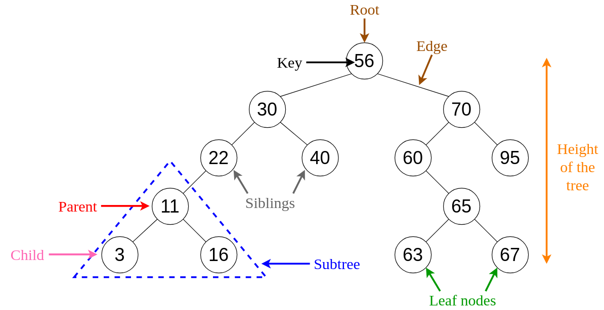

# Class 15: Trees (Binary Trees & Binary Search Trees)

## [Trees](https://codefellows.github.io/common_curriculum/data_structures_and_algorithms/Code_401/class-15/resources/Trees.html)


## Common Terminology

- **Node** - A node is the individual item/data that makes up the data structure
- **Root** - The root is the first/top Node in the tree
- **Left Child** - The node that is positioned to the left of a root or node
- **Right Child** - The node that is positioned to the right of a root or node
- **Edge** - The edge in a tree is the link between a parent and child node
- **Leaf** - A leaf is a node that does not contain any children
- **Height** - The height of a tree is determined by the number of edges from the root to the bottommost node



## Traversals

### Depth First

Depth first traversal is where we prioritize going through the depth (height) of the tree first. There are multiple ways to carry out depth first traversal, and each method changes the order in which we search/print the `root`. 

**Ways that you can Traverse a tree**

- **Pre-order**: `root >> left >> right`
- **In-order**: `left >> root >> right`
- **Post-order**: `left >> right >> root`


> The various outputs for traversing this tree would look like these examples below:
> - **Pre-order**: A, B, D, E, C, F
> - **In-order**: D, B, E, A, F, C
> - **Post-order**: D, E, B, F, C, A

**Recursion is the best way to traverse through a tree. With these traversals, we rely on the call stack to navigate back up the tree when we have reached the end of a sub-path.**

## Pre-order pseudocode

```
ALGORITHM preOrder(root)

  OUTPUT <-- root.value

  if root.left is not NULL
      preOrder(root.left)

  if root.right is not NULL
      preOrder(root.right)
```


**Pre-order** means that the code should assgin the top value of the tree to the `root` value of the tree first and send that node through the function. Next, the code should look at the `root.left` and `root.right` values, if there is a values at `root.left`then it should send that node through the function, if not then it should send `root.right` through the function. As the function traverses the tree each value is added to a `stack`.

Your code should continue to do this until it reaches a `leaf` node (A `leaf` is a node that does not contain any children, or simply no `left` or `right` values). 

The most recent value will `pop` off of the call stack and the root will be reassigned back to the previous `root`.

> This is the heart of recursion: when we complete a function call, we `pop` it off the stack and are able to continue execution through the previous function call.

The code block will now pick up where it left off when the previous `root` was the current `root`. Since it already looked for `root.left`, it will now look for `root.right`.

Now that the `root` is checking the `root.right` value, if a value exists, that value will be added to the `stack`, and the node will be checked for both a `root.left` and a `root.right`.

This process will continue until it hits another `leaf` value, then it will `pop` values off the stack until it finds another `root.right` value that has not been checked. 

This process will continue, of adding and popping values from the stack, until the entire Tree's values have been checked.

> ### Remember: You should always be checking both `left` and `right` but working with the `left` values until it hits a `leaf` and then be moving on to working with the `right` values!!!!

<br>

## Pre-order
```
ALGORITHM preOrder(root)
// INPUT <-- root node
// OUTPUT <-- pre-order output of tree node's values

    OUTPUT <-- root.value

    if root.left is not Null
        preOrder(root.left)

    if root.right is not NULL
        preOrder(root.right)
```
## In-order
```
ALGORITHM inOrder(root)
// INPUT <-- root node
// OUTPUT <-- in-order output of tree node's values

    if root.left is not NULL
        inOrder(root.left)

    OUTPUT <-- root.value

    if root.right is not NULL
        inOrder(root.right)
```
## Post-order
```
ALGORITHM postOrder(root)
// INPUT <-- root node
// OUTPUT <-- post-order output of tree node's values

    if root.left is not NULL
        postOrder(root.left)

    if root.right is not NULL
        postOrder(root.right)

    OUTPUT <-- root.value
```

> Notice the similarities between the three different traversals above. The biggest difference between each of the traversals is ***when you are looking at the root node***.

## Breadth First

**Breadth first traversal iterates through the tree by going through each level of the tree node-by-node.**

You're going broad rather than deep.

You can possibly use a list and pop the values off as you go through, rather than using a queue.


## Binary Search Trees

Everything on the left **HAS** to be amaller than the `root` node, and everything on the right **HAS** to be larger than the `root` node.

## Good question for possible interview:

### **Is this tree balanced?**